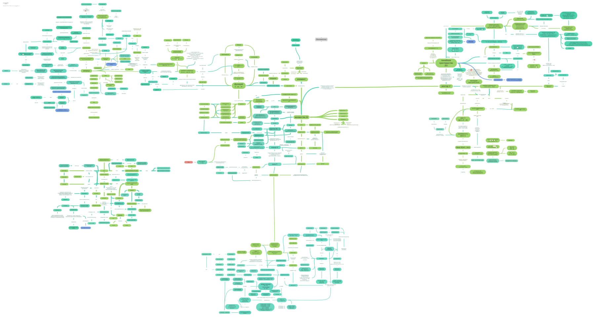

# Ravel

**Инструмент для ручного проектирования персональных баз знаний с типизированными связями, пространственной семантикой и иерархической раскладкой.**


Ravel — десктопное приложение для создания структурированных баз знаний в форме ориентированного графа. Структура строится пользователем осознанно: каждый узел и каждая связь добавляются вручную, а система только советует — обнаруживает циклы, выделяет хабы, предлагает упорядочить перегруженные области.

*Название — от англ. ravel: «запутывать» и «распутывать» (контроним). Иерархия знаний неоднозначна и строится под задачу; Ravel помогает эту спутанность распутать, не отнимая ручного контроля.*

## Почему Ravel

**Новизна — не в алгоритмах, а в композиции и философии.** Иерархическая раскладка (Сугияма), семантика положения (semantic substrates, conceptual spaces) и типизированные связи сами по себе известны. Новизна Ravel — в их сочетании под принципом «ручное управление; автоматика только советует»: ни один существующий инструмент не даёт одновременно типизированных связей, онтологически осмысленной раскладки и полного ручного контроля над структурой. Подробное позиционирование и обзор связанных работ — [docs/spec.md](docs/spec.md) §2.

## Оглавление

- [Быстрый старт](#быстрый-старт)
- [Статус проекта](#статус-проекта)
- [Ключевые возможности](#ключевые-возможности)
- [Скриншоты и примеры](#скриншоты-и-примеры-использования)
- [Документация](#документация)
- [Ограничения](#ограничения)
- [Contributing](#contributing)
- [Лицензия](#лицензия)

## Быстрый старт

Требования: CMake ≥ 3.20, компилятор с C++17, Qt 6 (модуль Widgets).

```bash
git clone https://github.com/<user>/ravel-kb.git
cd ravel-kb
cmake -B build -DCMAKE_BUILD_TYPE=Release
cmake --build build
./build/ravel
```

Тесты:

```bash
ctest --test-dir build --output-on-failure
```

**Windows / Visual Studio 2022.** Да, проект полностью собирается в MSVC: установите Qt 6 (кит MSVC 2019/2022), затем:

```powershell
cmake -B build -G "Visual Studio 17 2022" -DCMAKE_PREFIX_PATH="C:/Users/nexrf/Qt/6.8.3/msvc2022_64"
cmake --build build --config Release
ctest --test-dir build -C Release --output-on-failure
```

Открыть можно и как `build/ravel-kb.sln`. GoogleTest и nlohmann/json подтягиваются через FetchContent при первой конфигурации (нужен интернет). `windeployqt` запускается автоматически после сборки — собранный `build/bin/Release/ravel.exe` работает вне IDE без дополнительных шагов. CI при этом может оставаться на Linux/gcc — ядро портируемо.

Если официальный установщик Qt недоступен или работает медленно (например, `download.qt.io` не открывается): Qt можно поставить без установщика и регистрации — скачав готовые бинарники с зеркала (например, `ftp.fau.de/qtproject/online/qtsdkrepository/...`) и распаковав их в выбранный каталог. Для разработки на Widgets достаточно архивов `qtbase`, `qttools`, `qtsvg`, `d3dcompiler`, `opengl32sw` (~70 МБ вместо ~2 ГБ полной установки).

## Статус проекта

Проект на **этапе 1** (ядро). Текущий план — аскетичный MVP курсовой работы: [docs/roadmap.md](docs/roadmap.md).

| Компонент | Статус |
|---|---|
| Модель данных `Graph` | 🚧 в разработке |
| Сериализация JSON | 📋 запланировано |
| Канвас (QGraphicsView) | 📋 запланировано |
| Раскладка (Сугияма с онтологическими лентами) | 📋 запланировано |
| Обнаружение циклов | 📋 запланировано |
| undo/redo (Command) | 📋 запланировано |

Отдалённые перспективы (фрактальная вложенность, алиасы, альтернативные иерархии и др.) вынесены в [docs/perspectives.md](docs/perspectives.md) и в план не входят.

## Ключевые возможности

- **Типизированные связи** — у каждой связи есть тип (`is_a`, `has_part`, `isomorphic_to`, …) со свойствами (симметрия, транзитивность); цвет и стиль стрелки зависят от типа.
- **Пространственная семантика** — две оси карты несут смысл: вертикаль — иерархия (общее сверху, частное снизу), горизонталь — онтологические «ленты» (классы узлов); подробнее: [docs/spec.md](docs/spec.md) §5.
- **Иерархическая раскладка** — собственная реализация алгоритма Сугияма; минимизация пересечений идёт внутри лент, так что семантика и оптимальность не конфликтуют.
- **Система предлагает — пользователь решает** — циклы, перегруженные хабы: любая автоматика — только рекомендация.

Подробная спецификация — [docs/spec.md](docs/spec.md), архитектура — [docs/architecture.md](docs/architecture.md), план — [docs/roadmap.md](docs/roadmap.md), «проект мечты» — [docs/perspectives.md](docs/perspectives.md).

## Скриншоты и примеры использования

- [x] «До»: реальная карта автора (Coggle) — пример неструктурированного конспекта по матанализу, который Ravel призван заменить. Клик по превью открывает полный PDF:

  [](docs/assets/mm_math.pdf)
- [ ] «После»: та же предметная область в Ravel (30–50 узлов)
- [ ] Скриншот: та же карта после иерархической раскладки
- [ ] Демонстрация: подсказка об обнаруженном цикле

## Документация

| Документ | Содержание |
|---|---|
| [docs/spec.md](docs/spec.md) | концепция, связанные работы, модель данных, семантическая раскладка |
| [docs/architecture.md](docs/architecture.md) | слои, обоснования абстракций, инварианты, паттерны |
| [docs/roadmap.md](docs/roadmap.md) | MVP-план на 12 недель, метрики успеха |
| [docs/perspectives.md](docs/perspectives.md) | отдалённые перспективы (фрактальность, алиасы, …) |
| [docs/research.md](docs/research.md) | исследовательская рамка: типизированная метрика, взвешенная раскладка, link prediction без LLM |
| `docs/adr/` | ключевые архитектурные решения (рекомендованы, не обязательны) |

Документация API генерируется Doxygen: `doxygen Doxyfile` → `docs/html`.

## Ограничения

- не предназначен для баз знаний > 10³ узлов;
- нет синхронизации, облака, коллективной работы;
- нет импорта из Obsidian / Coggle / Miro;
- формат JSON не совместим с другими инструментами;
- в MVP пользовательские типы связей задаются редактированием JSON.

## Contributing

См. [CONTRIBUTING.md](CONTRIBUTING.md). Кратко: ядро (`core/`) — чистый C++17 без Qt, покрыто юнит-тестами; UI зависит от ядра, но не наоборот.

## Лицензия

MIT
