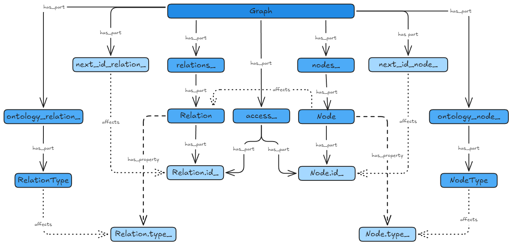

# Техническая спецификация реализации

> Здесь фиксируются выбранные решения по реализации `core/` и рассмотренные альтернативы. Каждое решение — короткая запись «принято / отвергнуто / почему», чтобы развилка не переоткрывалась заново. Документ жёстче, чем [perspectives.md](perspectives.md) (там — развитие за пределами курсовой), и мягче, чем [spec.md](spec.md) (там — требования к продукту; здесь — способы их выполнения). Изменения фиксируются в том же commit flow, что и код.

## R1. Два счётчика идентификаторов: `next_id_node_` и `next_id_relation_`

**Принято.** Отдельный монотонный счётчик для узлов и для рёбер.

**Отвергнутая альтернатива.** Единый счётчик `next_id` на оба вида сущностей (так было написано в spec.md §4.2 первой редакцией).

**Обоснование.**

1. При общем пространстве id коллизии между узлами и рёбрами невозможны, но это не та ошибка, которая реально случается: коллизия возникает при переиспользовании id своего же вида. Раздельные счётчики исключают и её.
2. Реализация проще: «следующий id узла» и «следующий id ребра» читаются и валидируются независимо, правила валидации для каждого счётчика — одно, а не составное условие «больше максимума по объединённому множеству».
3. Размер типа не зависит от числа счётчиков: `uint64_t` в любом случае.

**Последствия для spec.md:** §4.2 абзац про `next_id` переписывается (единое пространство → два счётчика), §4.3 пример JSON меняется на `"next_id_node"` / `"next_id_relation"`. Старое значение `next_id: 6` в примере снимает смысл — в примере узлы 1–3 и рёбра 4–5, новые поля: `next_id_node: 4`, `next_id_relation: 6`.

## R2. Хранение узлов и рёбер: `std::vector` с индексом = id

**Принято.** `std::vector<Node> nodes_` и `std::vector<Relation> relations_`, где индекс элемента равен его id (слот 0 не используется, id начинаются с 1). При удалении узла/ребра его слот остаётся занятым «дыркой»: Node/Relation очищается в пустое состояние (move-assignment пустого объекта). Существование узла определяется наличием записи в `access_`.

**Отвергнутая альтернатива (вариант Б).** Пометка `deleted` внутри Node/Relation или обёртка `std::optional` — отдельный флаг сущности. Отвергнута: лишнее поле в каждой записи и вторая логика проверки существования, когда уже есть `access_` как единственный источник истины о «живых» узлах.

**Почему не `std::map<id, T>`.** Индекс = id даёт O(1) доступ и компактное хранение; пространство id неразрывно от начала до максимума, дырки — цена, которую платят только удалённые элементы. Для графов ~10³ узлов это несущественно, и выбор всё равно в пользу простоты индексации.

**Следствие.** `Node` и `Relation` должны быть move-assignable (правило пяти): очистка слота при удалении выполняется присваиванием. `Relation` кроме того копируем — команда удаления сохраняет удалённые рёбра для undo/redo (spec.md §4.4). Конструкторы копирования/перемещения по умолчанию, запрещать их не нужно.

## R3. Инцидентность: `std::map<NodeId, std::vector<RelationId>> access_`

**Принято.** Узел → вектор id всех инцидентных рёбер; для изолированного узла — пустой вектор. Только живые узлы имеют записи.

**Отвергнутая альтернатива.** `std::unordered_map` — отвергнута не навсегда, а до замера: при ~10³ узлах теоретическое преимущество хэширования над красно-чёрным деревом (в среднем O(1) против O(log n)) может не окупать недетерминизм порядка обхода. `std::map` даёт бесплатный детерминизм: обход окрестности всегда возвращает соседей в одном порядке, что упрощает тесты, отладку и воспроизводимую раскладку.

**Открытая задача.** Измерить оба варианта на рабочем масштабе (google benchmark, графы 10²–10³ узлов, операции «соседи узла») — см. [perspectives.md](perspectives.md) §6.

**Смежная альтернатива, отвергнутая.** Хранить в `access_` сразу пары `std::pair<std::vector<RelationId>, std::vector<NodeId>>` (инцидентные рёбра + соседи). Отвергнута: второй вектор дублирует информацию, инвариант «рёбра и соседи согласованы» придётся поддерживать двумя правками вместо одной, а выигрыш — лишний проход по вектору рёбер, чтобы извлечь `to` из `from`.

## R4. Типы сущностей: словари с строковыми ключами

**Принято.** `std::unordered_map<std::string, NodeType> ontology_node_` и `std::unordered_map<std::string, RelationType> ontology_relation_`. Node/Relation ссылаются на тип по имени (строка в JSON, spec.md §4.3).

**Отвергнутая альтернатива.** `enum class` для фиксированного набора типов (`is_a`, `has_part`, …). Отвергнута: словарь типов расширяем пользователем через JSON (spec.md §4.5), enum требует перекомпиляции на каждый новый тип. Enum остаётся удобен только как набор констант-предложений по умолчанию.

**Обоснование строкового ключа.** Имя типа — пользовательский идентификатор; он же ключ в JSON, его же видит пользователь в диалогах. Прямое соответствие «строка в файле ↔ строка в памяти» убирает слой преобразований и источник рассинхронизации.

## R5. Описание узла: `std::string description`

**Принято.** Полное описание хранится строкой в Node. Размер типа в памяти не зависит от длины текста (SSO покрывает короткие описания, длинные — куча).

**Отвергнутая альтернатива.** Отложенное чтение описания из файла/внешнего хранилища по запросу. Отвергнута: описание нужно при каждом выборе узла (панель деталей), выигрыш в памяти на ~10³ узлах ничтожен, а цена — второй слой хранения и кода. Оптимизацию рассматривать, только если профилирование покажет проблему.

## R6. Позиция узла: в Node, необязательная

**Принято.** Ручная позиция — поле `Node` (не `NodeType`: позиция относится к экземпляру, а не к типу, spec.md §4.2). Наличие позиции опционально: узел без неё подчиняется раскладке.

**Закрыто (2026-09-21).** `std::optional<std::pair<double, double>>`: `std::nullopt` — позиция не задана, узел подчиняется раскладке; значение — ручное переопределение (spec §5.5). Отвергнутая альтернатива — сигнальная пара значений (NaN/−1): у неё нет типобезопасной проверки «задано ли», легко получить молчаливую ошибку. Опциональность не попадает в JSON: отсутствие поля `hand_position` и есть «не задано» (round-trip, spec §4.3).

## R7. Правила валидации счётчиков при загрузке

Загрузчик (слой `storage/`) проверяет и при нарушении отклоняет файл явной ошибкой:

1. `next_id_node_` строго больше максимального id узлов (для пустого множества узлов — не меньше стартового значения).
2. `next_id_relation_` строго больше максимального id рёбер (аналогично).
3. Молчаливая починка (автоматическое повышение счётчика) запрещена: см. обоснование в spec.md §4.2 и R1.

Это защита на границе слоя: недоверенный внешний файл валидируется один раз при входе, дальше внутри `Graph` инварианты поддерживаются конструкцией.

## Инварианты Graph (сводно)

1. Id не переиспользуются; `next_id_node_` / `next_id_relation_` строго больше всех существующих id своего вида.
2. Для любого ребра r и любого узла x: r лежит в `access_[x]` тогда и только тогда, когда x — это from или to ребра r.
3. `access_` содержит записи ровно для живых узлов: каждый живый узел имеет запись (возможно, с пустым вектором), ни один удалённый — нет.
4. Рёбра ссылаются только на существующие узлы: from и to каждого живого ребра — живые узлы.
5. Тип каждого узла и каждого ребра содержится в соответствующем словаре онтологии.

## Диаграмма классов ядра

Обозначения рёбер — в разделе «Условные обозначения диаграмм классов» ниже.

> **Заметка о собственном корме (dogfooding).** При рисовании этой схемы автору не хватило описаний **у узлов**: неочевидно, что такое `relations_` (это `std::vector<Relation>`), `ontology_node_` (`std::unordered_map<std::string, NodeType>`), `access_` (`std::map<NodeId, std::vector<RelationId>>`) — и **у связей**: ребро `has_part` из `Graph` в `Node`/`Relation` читается неоднозначно без пояснения, что владение означает именно жизненный цикл, а не «ссылка на». Это та самая боль, для которой в Ravel заведены описания узлов и связей (spec.md §4.2): схема — живое обоснование фичи, а не выдуманный use case.

## Эмпирические правила

Правила, выученные на ошибках — общие для всего проекта, не привязаны к конкретному решению.

1. **Структура меняется по запросу алгоритма, не забегая вперёд.** Не объявляются конструкторы, спец-члены, поля и флаги «на вырост»: появился запрос (undo требует копирования `Relation`, очистка слота — move-assign у `Node`) — структура меняется под него. Преждевременные объявления дороже отсутствующих: они создают противоречия, которые потом приходится разгребать (см. первую редакцию `graph.hpp`).
2. **Правило пяти — только при ручном владении ресурсом.** Сырые указатели, дескрипторы, HANDLE — объявляем всё пять и думаем. Нет ресурса — правило нуля: спец-члены не объявляются вовсе, компилятор генерирует корректные. `= delete` по привычке — такой же дефект, как и отсутствие `= delete` там, где он нужен.
3. **Порядок объявлений в заголовке повторяет зависимости.** Кем пользуются — объявляется выше; кто зависит — ниже. Если порядок приходится ломать, это симптом циклической зависимости, а не повод для forward-объявлений.
4. **Всё, что можно вычислить из модели, в модели не хранится.** Производные значения (прозрачность рёбер, размер по степени без ручного переопределения) — слой отрисовки или вычисляемые геттеры. Поле, дублирующее выводимое, — будущий источник рассинхронизации.
5. **Инварианты — комментариями рядом с данными, которые их поддерживают.** Информация существует ровно там, где её проверяют; перенос инварианта «в общий список в документации» гарантирует, что при смене структуры код исправят, а комментарий — нет.
6. **Подозрительный вход отвергается явно, а не правится молча.** Валидация на границе слоя (файл — для `storage`), с сообщением, достаточным для исправления файла руками.

## Условные обозначения диаграмм классов

Легенда обязательна к любой диаграмме в документах проекта — подписи ребра без словаря не несут семантики (это же аргумент Ravel против «линий без типов»).

- **`has_part` — композиция.** Целое владеет частью: часть не переживает целое и не разделяется между владельцами (узлы в `nodes_` умирают вместе с `Graph`).
- **`has_property` — подчинение общему определению.** Экземпляр следует принципу, применимому ко многим (ср. рефлексивность/ассоциативность как свойства отношения): `Node has_property NodeType` — узел подчиняется определению своего типа. Не путать с чтением UML, где «property» = поле-значение: здесь значение имеет легенда, а не привычка читателя.
- **`affects` — производная зависимость (пунктир).** Изменение источника требует инвалидации или пересчёта цели. Не хранится в памяти как объект и существует во времени исполнения, а не в статической структуре: `next_id_node_ affects NodeId` (счётчик определяет значения будущих id), `Node affects access_` (удаление/добавление узла требует пересборки его записи инцидентности).
