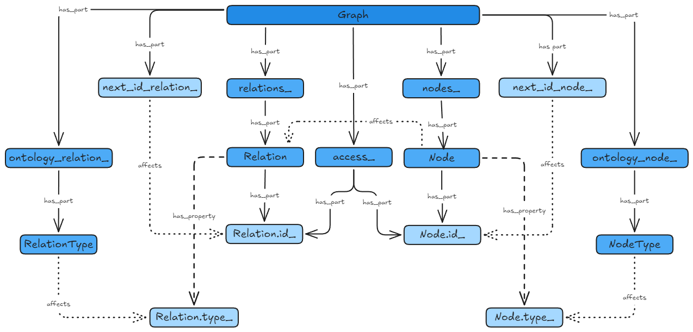

# Техническая спецификация реализации

> Здесь фиксируются выбранные решения по реализации `core/` и рассмотренные альтернативы. Каждое решение — короткая запись «принято / отвергнуто / почему», чтобы развилка не переоткрывалась заново. Документ жёстче, чем [perspectives.md](perspectives.md) (там — развитие за пределами курсовой), и мягче, чем [spec.md](spec.md) (там — требования к продукту; здесь — способы их выполнения). Изменения фиксируются в том же commit flow, что и код.

## R1. Два счётчика идентификаторов: `next_id_node_` и `next_id_relation_`

**Принято.** Отдельный монотонный счётчик для узлов и для рёбер.

**Отвергнутая альтернатива.** Единый счётчик `next_id` на оба вида сущностей (так было написано в spec.md §4.2 первой редакцией).

**Обоснование.**

1. При общем пространстве id коллизии между узлами и рёбрами невозможны, но это не та ошибка, которая реально случается: коллизия возникает при переиспользовании id своего же вида. Раздельные счётчики исключают и её.
2. Реализация проще: «следующий id узла» и «следующий id ребра» читаются и валидируются независимо, правила валидации для каждого счётчика — одно, а не составное условие «больше максимума по объединённому множеству».
3. Размер типа не зависит от числа счётчиков: `uint64_t` в любом случае.

**Последствия для spec.md:** §4.2 абзац про `next_id` переписывается (единое пространство → два счётчика), §4.3 пример JSON меняется на `"next_id_node"` / `"next_id_relation"`. Старое значение `next_id: 6` в примере снимает смысл — в примере узлы 1–3 и рёбра 4–5, новые поля: `next_id_node: 4`, `next_id_relation: 6`.

## R2. Хранение узлов и рёбер: `std::vector` с индексом = id

**Принято.** `std::vector<Node> nodes_` и `std::vector<Relation> relations_`, где **индекс = id − 1** (id начинаются с 1; `emplace_back` кладёт узел id на индекс id − 1 автоматически, смещение живёт только в квадратных скобках индексации — `GetNode`/`GetRelation`). При удалении узла/ребра его слот остаётся занятым «дыркой»: запись заменяется фиктивным объектом с id 0. Существование определяется наличием записи в `access_` (для узлов) и совпадением id со слотом (для рёбер) — см. эмпирическое правило 14.

**Отвергнутая альтернатива (вариант Б).** Пометка `deleted` внутри Node/Relation или обёртка `std::optional` — отдельный флаг сущности. Отвергнута: лишнее поле в каждой записи и вторая логика проверки существования, когда уже есть `access_` как единственный источник истины о «живых» узлах.

**Почему не `std::map<id, T>`.** Индекс = id даёт O(1) доступ и компактное хранение; пространство id неразрывно от начала до максимума, дырки — цена, которую платят только удалённые элементы. Для графов ~10³ узлов это несущественно, и выбор всё равно в пользу простоты индексации.

**Следствие.** `Node` и `Relation` должны быть move-assignable (правило пяти): очистка слота при удалении выполняется присваиванием. `Relation` кроме того копируем — команда удаления сохраняет удалённые рёбра для undo/redo (spec.md §4.4). Конструкторы копирования/перемещения по умолчанию, запрещать их не нужно.

## R3. Инцидентность: `std::map<NodeId, std::vector<RelationId>> access_` 

**Принято.** Узел → вектор id всех инцидентных рёбер; для изолированного узла — пустой вектор. Только живые узлы имеют записи.

**Отвергнутая альтернатива.** `std::unordered_map` — отвергнута не навсегда, а до замера: при ~10³ узлах теоретическое преимущество хэширования над красно-чёрным деревом (в среднем O(1) против O(log n)) может не окупать недетерминизм порядка обхода. `std::map` даёт бесплатный детерминизм: обход окрестности всегда возвращает соседей в одном порядке, что упрощает тесты, отладку и воспроизводимую раскладку.

**Открытая задача.** Измерить оба варианта на рабочем масштабе (google benchmark, графы 10²–10³ узлов, операции «соседи узла») — см. [perspectives.md](perspectives.md) §6.

**Смежная альтернатива, отвергнутая.** Хранить в `access_` сразу пары `std::pair<std::vector<RelationId>, std::vector<NodeId>>` (инцидентные рёбра + соседи). Отвергнута: второй вектор дублирует информацию, инвариант «рёбра и соседи согласованы» придётся поддерживать двумя правками вместо одной, а выигрыш — лишний проход по вектору рёбер, чтобы извлечь `to` из `from`.

**Выбор внутри записи: `std::vector<RelationId>`, не `std::set` (2026-09-23).** Аргументы за set — O(log n) поиск/удаление по значению и неинвалидирующий erase — отвергнуты: (1) set при дубликате молча ничего не делает, а дубликат id ребра в окрестности — баг, который должен всплывать в тестах, а не растворяться в структуре; (2) память и локальность — узел дерева ~32 байта на элемент против плотного массива, а итерация по окрестности — горячая операция раскладки. Порядок: vector хранит порядок добавления, set сортировал бы по id — оба детерминированы, на рабочем масштабе разницы нет. Дубликаты страхуем тестом-инвариантом (нет повторов в окрестности), а не структурой. Выбор за прозрачностью vector.

## R4. Типы сущностей: словари с строковыми ключами

**Принято.** `std::unordered_map<std::string, NodeType> ontology_node_` и `std::unordered_map<std::string, RelationType> ontology_relation_`. Node/Relation ссылаются на тип по имени (строка в JSON, spec.md §4.3).

**Отвергнутая альтернатива.** `enum class` для фиксированного набора типов (`is_a`, `has_part`, …). Отвергнута: словарь типов расширяем пользователем через JSON (spec.md §4.5), enum требует перекомпиляции на каждый новый тип. Enum остаётся удобен только как набор констант-предложений по умолчанию.

**Обоснование строкового ключа.** Имя типа — пользовательский идентификатор; он же ключ в JSON, его же видит пользователь в диалогах. Прямое соответствие «строка в файле ↔ строка в памяти» убирает слой преобразований и источник рассинхронизации.

## R5. Описание узла: `std::string description`

**Принято.** Полное описание хранится строкой в Node. Размер типа в памяти не зависит от длины текста (SSO покрывает короткие описания, длинные — куча).

**Отвергнутая альтернатива.** Отложенное чтение описания из файла/внешнего хранилища по запросу. Отвергнута: описание нужно при каждом выборе узла (панель деталей), выигрыш в памяти на ~10³ узлах ничтожен, а цена — второй слой хранения и кода. Оптимизацию рассматривать, только если профилирование покажет проблему.

## R6. Позиция узла: в Node, необязательная

**Принято.** Ручная позиция — поле `Node` (не `NodeType`: позиция относится к экземпляру, а не к типу, spec.md §4.2). Наличие позиции опционально: узел без неё подчиняется раскладке.

**Закрыто (2026-09-21).** `std::optional<std::pair<double, double>>`: `std::nullopt` — позиция не задана, узел подчиняется раскладке; значение — ручное переопределение (spec §5.5). Отвергнутая альтернатива — сигнальная пара значений (NaN/−1): у неё нет типобезопасной проверки «задано ли», легко получить молчаливую ошибку. Опциональность не попадает в JSON: отсутствие поля `hand_position` и есть «не задано» (round-trip, spec §4.3).

## R7. Правила валидации счётчиков при загрузке

Загрузчик (слой `storage/`) проверяет и при нарушении отклоняет файл явной ошибкой:

1. `next_id_node_` строго больше максимального id узлов (для пустого множества узлов — не меньше стартового значения).
2. `next_id_relation_` строго больше максимального id рёбер (аналогично).
3. Молчаливая починка (автоматическое повышение счётчика) запрещена: см. обоснование в spec.md §4.2 и R1.

Это защита на границе слоя: недоверенный внешний файл валидируется один раз при входе, дальше внутри `Graph` инварианты поддерживаются конструкцией.

## R8. Имя типа — только ключ словаря; записи словаря неизменяемы

**Принято.** У `NodeType`/`RelationType` нет поля `name_`: ключ `unordered_map` — единственный источник имени типа. Классы неизменяемы после создания (конструктор со всеми параметрами, нет сеттеров); «переименование» = создание нового типа (spec.md §4.5 фиксирует неизменяемость как продуктовое решение; здесь — её техническое следствие).

**Отвергнутая альтернатива.** Хранить `name_` внутри записи вдобавок к ключу. Отвергнута как денормализация: одна информация в двух местах — это новый инвариант «ключ == name_», который ничто не проверяет, и гарантированная когда-нибудь рассинхронизация. При обходе словаря ключ доступен рядом со значением (structured bindings, C++17).

**Отвергнутая альтернатива.** Публичные поля-структуры ради «простоты заполнения». Отвергнута: без конструктора невозможно выразить «тип существует только полностью заданным» — то же правило «тип отстаивает своё», что и отсутствие `Node()` (см. эмпирические правила).

## R9. Ключи файлового формата: `relations` и `node_types` (синхронизация 2026-09-25)

**Принято.** Секция рёбер в файле называется `relations`, секция словаря типов узлов — `node_types` (spec.md §4.3, пример JSON).

**Отвергнутая альтернатива.** Ключ `edges` (так было в первой редакции примера §4.3) — отвергнут как рассинхрон с кодом и документацией: класс `Relation`, инварианты Graph, тексты spec и implementation повсюду говорят «relation/связь»; единственное место со словом «edges» — пример JSON, то есть формат файла расходился бы с моделью, которую сериализует. Файл — тоже интерфейс: пользователь правит его руками (§4.5), и имена ключей должны совпадать с терминами диалогов и документации.

**Синхронизировано заодно.** В пример §4.3 добавлена секция `node_types`: в коде словарь `ontology_node_` существует с недели 1, инвариант 5 («тип каждого узла содержится в словаре») требует его наличия в файле, а в примере секция отсутствовала. В §4.2 добавлен пункт «Тип узла» (свойства `color`, `shape`, `frame_color` — по полям `NodeType`).

## R10. JsonStorage: контракт Load/Save (2026-09-26)

**Принято.**

1. `Load` возвращает `Graph` по значению. Полученный Graph гарантированно валиден: недопустимы полуинициализированные состояния (принцип «тип отстаивает своё»), при исключении в середине загрузки частичный Graph уничтожается раскруткой стека. Бонус: откат к предыдущей версии файла (как в Coggle) достаётся бесплатно — старый файл и есть старая версия.
2. Validate-then-apply: два прохода. Сначала полная валидация JSON вне Graph (`format_version` → счётчики против max id своего вида → словари типов → тип каждого узла/ребра в соответствующем словаре), затем построение Graph через публичный API (`AddNodeType`/`AddRelationType`/`AddNode`/`AddRelation`). Storage не имеет доступа к приватным членам Graph — инварианты поддерживает только Graph (см. правило 11).
3. Валидация формата цвета (`#RRGGBB`) — на входе в Graph (`AddNodeType`/`AddRelationType`), не в Save: Graph недопустимо долго жить с некорректными данными, чтобы ошибка всплыла в другом слое. Save доверяет инвариантам Graph и пишет то, что есть.
4. Работа с потоками (`std::istream&` / `std::ostream&`), не с путями файлов: round-trip тесты не трогают диск (источник — `std::stringstream`), открытие файлов — забота слоя `app`. Выбор потоков перед строкой (2026-10-03): поток — самый абстрактный источник байтов, не привязанный к конкретному контейнеру; композируется с будущими источниками (gzip, сокет для §11 perspectives) без промежуточной материализации. DOM-парсинг nlohmann всё равно держит документ в памяти, поэтому поток здесь не оптимизация, а зафиксированное направление зависимости: storage получает байты, но не владеет их происхождением. Строка отвергнута: весь выигрыш — пара строк кода (`dump()`/`parse`), испаряющийся при первом не-файловом источнике.

**Отвергнутые альтернативы.**

- `Load(path_to_graph_by_reference)`: полуинициализированный Graph снаружи, лишение Graph контроля над своими инвариантами.
- Интерфейс `IStorage` сейчас: преждевременная структура — вторая реализация не запланирована, mock не нужен (тесты ходят в JsonStorage напрямую). Интерфейс выделится при появлении второго хранилища, его контракт будет известен из двух реальных классов, а не угадан (см. эмпирическое правило 1). Развилка фиксируется, чтобы не переоткрывалась.
- Валидация цвета в Save: откладывает диагностику от места порождения ошибки (принцип «валидация на границе слоя» — а публичный API Graph тоже граница).

**Дополнено.** Пункт 2 изменён: построение через публичный API заменено на `GraphSnapshot` + проверяемую фабрику `Graph::FromSnapshot(...)` — см. R11. Отвергнутые там friend и публичная фабрика без снимка здесь не дублируются.

**Дополнено (2026-10-01).** Пункт 3 уточнён: валидация `#RRGGBB` перенесена из `AddNodeType`/`AddRelationType` в конструкторы `NodeType`/`RelationType` (`isValidHexColor`, `inline` в заголовке). Конструкторская точка сильнее границы Graph: тип существует только валидным (правило «тип отстаивает своё»), и валидация покрывает любой путь создания типа, а не только путь через Graph. Граница Graph остаётся второй линией обороны (дубли имён в словарях). Отвергнутая альтернатива «валидация в Save» закрыта ранее и остаётся закрытой.

## R11. Загрузка: `GraphSnapshot` + `Graph::FromSnapshot` (2026-09-29, по рекомендации преподавателя)

**Принято.** Трёхсторонняя схема: JsonStorage разбирает JSON ↔ `GraphSnapshot`; Graph валидирует снимок и сам восстанавливает внутренние структуры. Снимок — нейтральные данные без формата: словари типов, живые узлы и рёбра с их исходными id, счётчики.

**Почему публичная фабрика здесь не опасна.** Возражение против публичной фабрики было «любой сможет создать Graph с поддельными счётчиками». Рекомендация преподавателя разделяет две вещи: публичность *метода* и отсутствие *валидации*. `FromSnapshot` обязана отклонять неверные данные явно (счётчики ≤ max id своего вида, типы вне словарей, концы связей на несуществующие узлы — инварианты 1, 4, 5). Метода вставки произвольного id в *существующий* граф при этом не появляется — монополия Graph на выдачу id сохраняется.

**Обязательная деталь восстановления.** Файл хранит только живые узлы; при живых id 1, 2, 5 и выданных до 8 счётчик обязан вернуться равным 9 (инвариант 1). `FromSnapshot` восстанавливает слоты хранения (R2): живые записи — на свои индексы (id − 1), удалённые слоты до `next_id − 1` — фиктивными объектами (id 0). Без этого первый же `emplace_back` нарушил бы соответствие «индекс = id − 1». Следствие для формата: дырки в файле не хранятся и не передаются — они восстанавливаются графом из семантики счётчика.

**Нормализация пустого снимка и проверка уникальности (2026-10-01).** Счётчики, равные 0, отвергаются: минимальный легальный снимок — `next_id_node = next_id_relation = 1` с пустыми векторами (он равен стартовому состоянию `Graph()`). Проверка «счётчик > max id» (инвариант 1) применяется только к непустым спискам: максимум существует лишь тогда, когда сущности есть; для пустого списка допустим любой счётчик ≥ 1 (все сущности удалены). Уникальность id проверяется слиянием проверки и вставки в `std::unordered_set`: `!set.insert(id).second` бросает при дубле — одно обращение к таблице вместо пары `count` + `insert`; направление флага: `true` — вставил (новый), `false` — уже был (дубль).

**Порядок сериализации (2026-10-02).** `ToSnapshot` кладёт живые узлы и рёбра в снимок по возрастанию id (обход слотов). Причина — детерминизм побайтового round-trip (тест `StorageLoadSave.RoundTrip` сравнивает строки), а не требование формата: загрузчик принимает любой порядок векторов снимка. Следствие: `FromSnapshot` не должна полагаться на порядок входных векторов — это свойство одной стороны преобразования, а не контракта обеих.

**Следствия.**
- Геттеры словарей через `const&` — допустимы (подтверждено): запрет на изменение сохранён; раскрытие выбора контейнера и срок жизни ссылок — принятая цена.
- Небольшое поведение у Node/Relation оправдано: основные инварианты относятся к графу целиком.
- `GraphSource` отложен; второго полный формат будет строить тот же снимок.
- Ответственность Graph признана связной (поддержка корректного состояния карты); словари типов могут позднее стать отдельным объектом, сериализация, история команд и алгоритмы развиваются за пределами Graph.

**Отвергнутые альтернативы (фиксируются закрытыми).** friend + приватная фабрика (обсуждено в R10-дополнении); `GraphSource` сейчас; построение через публичный API с перенумерацией (ломает идентичность, §4.2 spec).

**Геттеры словарей: рассмотрение итераторной альтернативы (2026-09-30).** Помимо `const&` рассмотрены: пара `begin()/end()` — отвергнута (тот же тип контейнера в сигнатуре, сокрытия нет, читаемость хуже range-for); callback-итерация `ForEachNodeType(fn)` — единственный вариант, реально скрывающий контейнер, отвергнута (плохо компонуется; преждевременна при одном потребителе, правило 1); кастомный итератор-фасад — отвергнут (обёртка с семантикой контейнера без реального потребителя). Сокрытие контейнера откладывается до выделения словарей в отдельный объект: фасад появится вместе с потребителем. Контракт срока жизни ссылок фиксируется Doxygen-комментарием у геттера («lifetime bound to *this; do not store beyond the Graph's lifetime»); каналы — документация и ревью: запрет кэшировать `const&` из геттера в поле класса между мутирующими вызовами. Тестами висячую ссылку не поймать (это UB), поэтому канал только документационный.

## Инварианты Graph (сводно)

1. Id не переиспользуются; `next_id_node_` / `next_id_relation_` строго больше всех существующих id своего вида.
2. Для любого ребра r и любого узла x: r лежит в `access_[x]` тогда и только тогда, когда x — это from или to ребра r.
3. `access_` содержит записи ровно для живых узлов: каждый живый узел имеет запись (возможно, с пустым вектором), ни один удалённый — нет.
4. Рёбра ссылаются только на существующие узлы: from и to каждого живого ребра — живые узлы.
5. Тип каждого узла и каждого ребра содержится в соответствующем словаре онтологии.

## Диаграмма классов ядра

Обозначения рёбер — в разделе «Условные обозначения диаграмм классов» ниже.

> **Заметка о собственном корме (dogfooding).** При рисовании этой схемы автору не хватило описаний **у узлов**: неочевидно, что такое `relations_` (это `std::vector<Relation>`), `ontology_node_` (`std::unordered_map<std::string, NodeType>`), `access_` (`std::map<NodeId, std::vector<RelationId>>`) — и **у связей**: ребро `has_part` из `Graph` в `Node`/`Relation` читается неоднозначно без пояснения, что владение означает именно жизненный цикл, а не «ссылка на». Это та самая боль, для которой в Ravel заведены описания узлов и связей (spec.md §4.2): схема — живое обоснование фичи, а не выдуманный use case.

## Эмпирические правила

Правила, выученные на ошибках — общие для всего проекта, не привязаны к конкретному решению.

1. **Структура меняется по запросу алгоритма, не забегая вперёд.** Не объявляются конструкторы, спец-члены, поля и флаги «на вырост»: появился запрос (undo требует копирования `Relation`, очистка слота — move-assign у `Node`) — структура меняется под него. Преждевременные объявления дороже отсутствующих: они создают противоречия, которые потом приходится разгребать (см. первую редакцию `graph.hpp`).
2. **Правило пяти — только при ручном владении ресурсом.** Сырые указатели, дескрипторы, HANDLE — объявляем всё пять и думаем. Нет ресурса — правило нуля: спец-члены не объявляются вовсе, компилятор генерирует корректные. `= delete` по привычке — такой же дефект, как и отсутствие `= delete` там, где он нужен.
3. **Порядок объявлений в заголовке повторяет зависимости.** Кем пользуются — объявляется выше; кто зависит — ниже. Если порядок приходится ломать, это симптом циклической зависимости, а не повод для forward-объявлений.
4. **Всё, что можно вычислить из модели, в модели не хранится.** Производные значения (прозрачность рёбер, размер по степени без ручного переопределения) — слой отрисовки или вычисляемые геттеры. Поле, дублирующее выводимое, — будущий источник рассинхронизации.
5. **Инварианты — комментариями рядом с данными, которые их поддерживают.** Информация существует ровно там, где её проверяют; перенос инварианта «в общий список в документации» гарантирует, что при смене структуры код исправят, а комментарий — нет.
6. **Подозрительный вход отвергается явно, а не правится молча.** Валидация на границе слоя (файл — для `storage`), с сообщением, достаточным для исправления файла руками.
7. **Ошибки внутри заголовков STL — читать стек снизу вверх и искать свой вызов.** Библиотека не сломана: она честно сообщает, какое требование к типу нарушен. C2512 «в `<utility>`` про `NodeType(2)` оказался `operator[]` словаря, затребовавшим конструктор по умолчанию, — место падения инстанциации шаблона, а не место ошибки.
8. **Тип отстаивает своё.** Отсутствие конструктора по умолчанию — выраженный инвариант («узел/тип без обязательных данных не существует»). Не ослаблять тип ради удобства вызова — выбрать инструмент, который требование не предъявляет: `emplace_back` вместо `resize` (конструирует из аргументов в конце вектора), `emplace`/`insert_or_assign` вместо `operator[]` (конструирует на месте). Требование default-ctor от `resize`/`operator[]` — не каприз STL, а вопрос «а что лежало бы в созданном по умолчанию элементе?».
9. **Не называть члены класса именами типов (перекрытие имён).** Метод `Graph::Node(id)` скрыл имя класса `Node` во всей области `Graph`: `std::vector<Node>` ниже перестал компилироваться, породив четыре ошибки на соседней строке. Аксессоры называть через глагол (`GetNode`), имена типов остаются свободными.
10. **Геттеры у DTO — норма, а не анемичный провал.** `Node`/`Relation` — сущности-данные, зеркалящие JSON без собственного поведения; поведение живёт в `Graph` и алгоритмах. Сопутствующие нормы: читающие методы — `const`; `noexcept` — только там, где операция тривиальна (возврат по значению копирует строку и может аллоцировать — `noexcept` превратит беду в `std::terminate`); строки из геттеров возвращать `const std::string&`.
11. **`friend` не нужен при полном публичном контракте.** `Graph` — контейнер, `Node` — элемент: вектор не дружит с элементом, а пользуется его интерфейсом. Конструктор + геттеры + правило нуля покрывают все потребности `Graph` (чтение, замена слота присваиванием). Friend оправдан лишь для неразрывных пар (итератор ↔ контейнер); каждое появление friend — повод спросить «какой публичный контракт не доделан?».
12. **`initializer_list` — не контейнер, и не параметр метода.** Это view на временный const-массив, существующий только в точке braced-инициализации; конвертации из `vector` нет в принципе. Методы, которым предполагается передавать существующие контейнеры, принимают `std::vector` по значению — тогда работают и `{a, b}`, и готовый вектор, и (главное) метод получает копию, когда собирается модифицировать источник по частям: стирание из вектора, по которому в этот момент идёт цикл — UB, копия его исключает.
13. **Молчаливая «защита» структуры скрывает баги.** set не даст дубликат — и молча его проглотит; clamp отсечёт выход за диапазон — и скроет ошибку в данных. Нарушение должно всплывать явно (тест-инвариант, assert, исключение), а не растворяться в выбранной структуре данных. Проверяем поведение тестами, а не запрещаем структурой.
14. **Живость определяется одной структурой и читается из индекса, а не из данных.** Узел жив ⇔ есть запись в `access_`; ребро живо ⇔ его слот хранит его же id (у рёбер собственного индекса живости нет — асимметрия принципиальна, а не случайна). Проверка вида «сравнить объект с фиктивным маркером» делает живость зависимой от дисциплины записи маркера на каждом сайте удаления: забыл записать — `HasNode` молчаливо врёт. Данные чистятся для гигиены памяти; истину о живости несёт индекс.
15. **Читающие методы — `const`, и `const` не может строиться через `operator[]` словаря.** `map::operator[]` по дизайну неконстантен («get or create»: отсутствующий ключ молча создаёт запись — с точностью до п. 13). В `const`-методе использовать `.at()` после проверки существования (границы раньше доступа — см. п. 14): проверка живости своя, `.at()` — подстраховка на этом пути.
16. **Тесты — исполняемый контракт.** Смена семантики метода без обновления тестов — это не «тесты сломались», а сигнал: тесты удерживают контракт, который изменился. Меняя контракт, обновлять тесты в той же правке: пройти grep по старым утверждениям (`EXPECT_EQ(получить 2)` везде, где семантика сменилась) — оставшиеся зелёные тесты на старом поведении, а не новые провалы, есть признак недосмотра.
17. **На каждый `throw` в коде — негативный тест.** Позитивные тесты не покрывают запрещённое поведение: исключение, которое никто не проверяет, формально существует и фактически не гарантируется. Схема: `EXPECT_THROW({ ... }, DomainError)` (голый вызыв, бросающий исключение в теле теста, — провал теста; результат бросающего вызова нельзя присваивать) + проверка неизменности состояния (счётчики `next_id_*`, живые узлы): исключение обязано произойти до применения изменений, а не посреди них.
18. **Тест должен диагностировать расхождение сам.** `EXPECT_EQ(a, b)` на контейнерах вместо `EXPECT_TRUE(a == b)`: при падении печатает фактические значения обеих сторон, а не голый `false`. Именованные константы вместо магических чисел: каждый литерал обязан отвечать на «почему именно это число?» — иначе при изменении модели придётся гадать, случайность это или контракт.
19. **Инвалидация неоднородна: ссылки и итераторы одного контейнера умирают по разным правилам.** `std::unordered_map::emplace` инвалидирует итераторы, но не ссылки на элементы: `const V&` из геттера переживает добавление в словарь, итератор — нет. Прежде чем выбирать между «вернуть ссылку» и «вернуть итераторы» ради «безопасности», читают таблицу инвалидации конкретного контейнера: итераторная пара может оказаться *менее* надёжной, чем ссылка. (Неожиданный факт из обсуждения геттеров словарей, 2026-09-30.)
20. **Собирать после каждой законченной мысли, а не «когда допишу».** Короткий цикл «правка → сборка» локализует ошибку последней правкой: три раза за вечер (C2661 с `emplace` на 5 аргументов, C2678 с неконстантным `operator==`, default-ctor от `operator[]`) каждый раз выглядели бы как загадочная простыня из STL, будь они накоплены в одной сборке. Сборка — это не штрих к плану «дописать фичу», а инструмент локализации: ляп ищется в разнице между последней зелёной и текущей сборкой. (2026-09-30)
21. **Абстракция данных оправдана одним потребителем, абстракция поведения — только вторым.** Критерий «преждевременности» точнее, чем «нет двух реализаций»: структура-значение (снимок, DTO) оправдана одним использованием, если разделяет то, что иначе смешалось бы, — её контракт продиктован предметной областью и угадать его неправильно почти невозможно. Интерфейс (протокол взаимодействия) приходится *угадывать*: pull или push, потоковый или произвольный доступ, как сообщать об ошибке — и угаданный протокол дорого ломать, когда за ним встанут реализации. Формула: данные угадываются из предметной области, управление — нет. GraphSnapshot введён по этому правилу при одном потребителе; GraphSource будет выделен из двух реальных сериализаторов, а не спроектирован заранее. (2026-09-30)

## Условные обозначения диаграмм классов

Легенда обязательна к любой диаграмме в документах проекта — подписи ребра без словаря не несут семантики (это же аргумент Ravel против «линий без типов»).

- **`has_part` — композиция.** Целое владеет частью: часть не переживает целое и не разделяется между владельцами (узлы в `nodes_` умирают вместе с `Graph`).
- **`has_property` — подчинение общему определению.** Экземпляр следует принципу, применимому ко многим (ср. рефлексивность/ассоциативность как свойства отношения): `Node has_property NodeType` — узел подчиняется определению своего типа. Не путать с чтением UML, где «property» = поле-значение: здесь значение имеет легенда, а не привычка читателя.
- **`affects` — производная зависимость (пунктир).** Изменение источника требует инвалидации или пересчёта цели. Не хранится в памяти как объект и существует во времени исполнения, а не в статической структуре: `next_id_node_ affects NodeId` (счётчик определяет значения будущих id), `Node affects access_` (удаление/добавление узла требует пересборки его записи инцидентности).
